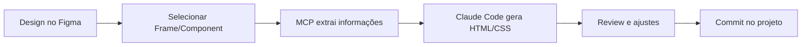

# Plano: Integração MCP Figma → Claude Code → VS Code para Geração de Código HTML/CSS

## Objetivo
Configurar workflow completo para converter designs do Figma em componentes HTML/CSS usando o MCP Figma Server + Claude Code no VS Code.

## Etapas do Plano

### 1. **Estrutura do Projeto**
- Criar estrutura base de diretórios:
  - `/components` - componentes HTML gerados
  - `/assets` - imagens e ícones exportados do Figma
  - `/styles` - arquivos CSS
- Criar `index.html` principal
- Criar `styles/main.css` com reset e variáveis base

### 2. **Configuração de Variáveis de Design**
- Conectar ao arquivo Figma via MCP para extrair tokens de design
- Criar `styles/variables.css` com:
  - Cores (CSS Custom Properties)
  - Tipografia (font-family, sizes, weights)
  - Espaçamentos e medidas
  - Shadows e borders

### 3. **Geração de Componentes**
- Usar MCP Figma tools para:
  - Extrair código HTML/CSS de frames específicos
  - Gerar componentes reutilizáveis
  - Exportar assets (imagens, ícones)
- Organizar componentes em arquivos separados
- Criar sistema de nomenclatura consistente

### 4. **Workflow de Desenvolvimento**
- Configurar slash command customizado no Claude Code para:
  - Facilitar conversão Figma → Código
  - Automatizar estruturação de componentes
- Documentar processo para futuras iterações

### 5. **Validação e Refinamento**
- Testar componentes gerados no navegador
- Ajustar responsividade e cross-browser compatibility
- Criar página de demonstração com todos os componentes

## Pré-requisitos Necessários
- URLs/IDs dos arquivos Figma (você mencionou que já tem)
- Acesso configurado ao Figma (token de autenticação no MCP server)

## Capacidades do MCP Figma Server

### Ferramentas Disponíveis
O servidor MCP Figma oferece três ferramentas principais:

1. **Code Generation Tool**: Gera código a partir de seleções do Figma
   - Suporta diferentes tipos de resposta
   - Pode ser configurado para React + Tailwind (ou HTML/CSS puro)

2. **Image Export Tool**: Exporta assets e previews
   - Imagens de componentes
   - Ícones e ilustrações
   - Previews para documentação

3. **Variables Tool**: Acessa definições de variáveis
   - Design tokens
   - Cores, tipografia, espaçamentos
   - Styles e componentes

### Como Funciona
- O servidor roda localmente em: `http://127.0.0.1:3845/mcp`
- Acessa metadados de design, componentes, variantes, variáveis e styles
- Permite buscar e inspecionar nodes e frames
- Integra com Code Connect para alinhar código gerado com codebase existente

## Workflow Recomendado

## Resultado Final
Projeto HTML/CSS estruturado com componentes extraídos do Figma, totalmente funcional e pronto para desenvolvimento.

---

**Status**: Planejamento concluído - Aguardando execução
**Data**: 2025-10-27
**Servidor MCP**: ✓ Conectado (figma @ http://127.0.0.1:3845/mcp)
